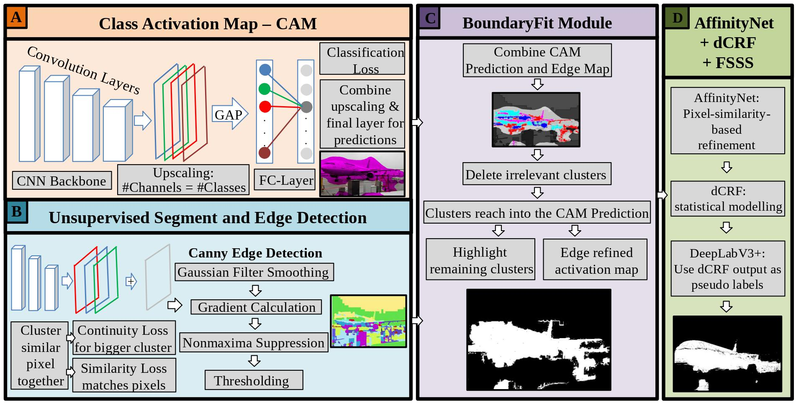
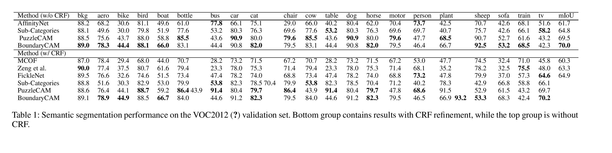

# BoundaryCAM
The official implementation of "BoundaryCAM: A Boundary-based Refinement Framework for Weakly Supervised Semantic Segmentation".


## Abstract
Weakly Supervised Semantic Segmentation (WSSS) with only image-level supervision is a promising approach to deal with the need of Segmentation networks, especially for generating large number of pixel-wise masks in a given dataset. However, most state-of-the-art image-level WSSS techniques lack an understanding of the geometric features embedded in the images since the network cannot derive any object boundary information from just image-level labels. We define boundary information here as the line separating the object and background. To address this drawback, we propose our novel BoundaryCAM framework, which deploys state-of-the-art class activation maps combined with various post-processing techniques in order to achieve fine-grained higher-accuracy segmentation masks. To achieve this, we investigate a wide-range of state-of-the-art unsupervised semantic segmentation networks and edge detection techniques to construct a boundary map, which enables BoundaryCAM to predict object locations with sharper boundaries. By applying our method to WSSS predictions, we were able to achieve up to 1.5% improvements, even to the benefit of already known edge-based methods like AffinityNet. We conduct exhaustive analysis to illustrate that BoundaryCAM enhances existing state-of-the-art WSSS methods.

## Overview


<br>

# Prerequisite
- Python 3.8, PyTorch 1.7.0, anaconda3 and more in requirements.txt
- CUDA 10.1, cuDNN 7.6.5

# Usage

## Install python dependencies
```bash
python3 -m pip install -r requirements.txt
```
## Create folder structure
Please create the following folder inside the Dataset folder:
- BoundaryFit_busi
- BoundaryFit_quick
- BoundaryFit_slic
- CAM_busi
- EM_quick
- EM_slic
- USS_quick
- USS_slic
Please create the following folder inside the Dataset folder with the sub folder 'benign' inside:
- USS_busi_slic/benign
- USS_busi_quick/benign
## Download PASCAL VOC 2012 devkit
Follow instructions in http://host.robots.ox.ac.uk/pascal/VOC/voc2012/#devkit,
copy the VOC2012 folder into the Dataset folder.
## Download BUSI Dataset
Follow instructions in https://www.kaggle.com/datasets/anaselmasry/datasetbusiwithgt,
copy the Dataset_BUSI_with_GT folder into the Dataset folder.
## Download PuzzleCAM model
Download the PuzzleCAM models from the experiments.zip in https://github.com/OFRIN/PuzzleCAM,
copy the ResNeSt101@Puzzle@optimal.pth model into the experiments/models folder.

# Evaluation of VOC2012

## 1. Inference the PuzzleCAM model and create Edge maps
1.1 Create a 'experiments' folder and inside it a 'models' and a 'predictions' folder
1.2 Inference the PuzzleCAM model
```bash
CUDA_VISIBLE_DEVICES=0 python3 inference_classification.py --architecture resnest101 --tag ResNeSt101@Puzzle@optimal --domain train_aug --data_dir $your_dir
```
1.3 Create USS segmentations and edge maps
```bash
python3 USS.py
python3 USS.py --segment quick
python3 Edge_detection.py
python3 Edge_detection.py --segment quick
```
## 2. Perform BoundaryFit
2.1 Create BoundaryFit masks
```bash
python3 BoundaryFit.py
python3 BoundaryFit.py --segment quick
```
2.2 Combine masks
```bash
python3 Combine_BoundaryFit.py
```


## 3. Apply AffinityNet to refine the generated CAMs
3.1. Make affinity labels to train AffinityNet.
```bash
CUDA_VISIBLE_DEVICES=0 python3 inference_classification.py --architecture resnest101 --tag Combined_BoundaryCAM --domain train_aug --data_dir $your_dir
python3 make_affinity_labels.py --experiment_name ResNeSt101@Puzzle@optimal@train@scale=0.5,1.0,1.5,2.0 --domain train_aug --fg_threshold 0.60 --bg_threshold 0.40 --data_dir $your_dir
```

3.2. Train AffinityNet.
```bash
CUDA_VISIBLE_DEVICES=0 python3 train_affinitynet.py --architecture resnest101 --tag AffinityNet@ResNeSt-101@Puzzle --label_name ResNeSt101@Puzzle@optimal@train@scale=0.5,1.0,1.5,2.0 --data_dir $your_dir
```

## 4. Train the segmentation model using the pseudo-labels
4.1. Make segmentation labels to train segmentation model.
```bash
CUDA_VISIBLE_DEVICES=0 python3 inference_rw.py --architecture resnest101 --model_name AffinityNet@ResNeSt-101@Puzzle --cam_dir ResNeSt101@Puzzle@optimal@train@scale=0.5,1.0,1.5,2.0 --domain train_aug --data_dir $your_dir
python3 make_pseudo_labels.py --experiment_name AffinityNet@ResNeSt-101@Puzzle@train@beta=10@exp_times=8@rw --domain train_aug --threshold 0.35 --crf_iteration 1 --data_dir $your_dir
```

4.2. Train segmentation model.
```bash
CUDA_VISIBLE_DEVICES=0,1,2,3 python3 train_segmentation.py --backbone resnest101 --mode fix --use_gn True --tag DeepLabv3+@ResNeSt-101@Fix@GN --label_name AffinityNet@ResNeSt-101@Puzzle@train@beta=10@exp_times=8@rw@crf=1 --data_dir $your_dir
```

## 5. Evaluate the models
```bash
CUDA_VISIBLE_DEVICES=0 python3 inference_segmentation.py --backbone resnest101 --mode fix --use_gn True --tag DeepLabv3+@ResNeSt-101@Fix@GN --scale 0.5,1.0,1.5,2.0 --iteration 10

python3 evaluate.py --experiment_name DeepLabv3+@ResNeSt-101@Fix@GN@val@scale=0.5,1.0,1.5,2.0@iteration=10 --domain val --data_dir $your_dir/SegmentationClass
```


# Evaluation of BUSI

## 1. Inferece Grad cam
1.1 Create USS segementations
```bash
python3 BUSI_USS.py
python3 BUSI_USS.py --segment quick
```
1.2 Inference GradCAM
```bash
python3 grad_cam.py
```
## 2. Perform BondaryFit
```bash
python3 BoundaryFit_busi.py
```
## 3. Evaluate Results
```bash
python3 evaluate_busi.py
```


## Class by class state-of-the-art comparison



## Download models and masks

- "experiments.zip" includes trained weights (AffinityNet and DeepLabv3+), masks for training (to train DeepLabV3+), and final evaluation masks (val and test VOC2012, BUSI benign)
[experiments.zip](https://drive.google.com/file/d/15sqVeYTf3MpKM0g0zdfFU2pYf7kz76Yo/view?usp=sharing)

- "BoundaryFit_busi.zip" include the results of BoundaryFit evaluation of the BUSI dataset, copy into the 'Dataset' folder for evaluation
[BoundaryFit_busi.zip](https://drive.google.com/file/d/16fRD4D91CwcEeMjxQMQOCkxZnaPTg6L9/view?usp=sharing)

