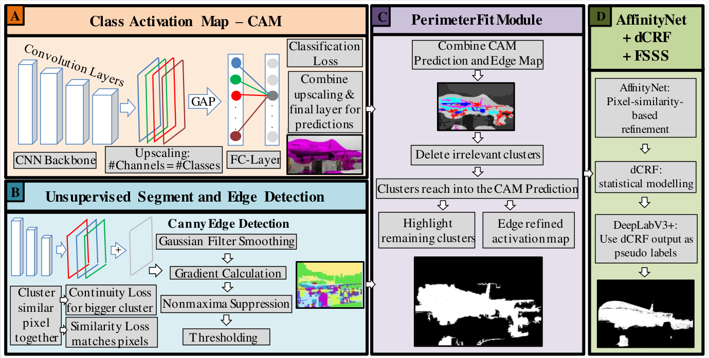
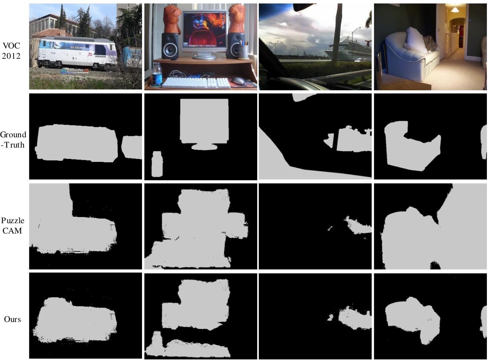

# Perimeter based Semantic Segmentation Using Image Labels Framework


## Abstract
Achieving high-quality semantic segmentation predictions using only image-level labels enables a new level of real-world applicability. Although state-of-the-art networks deliver reliable predictions, the amount of handcrafted pixel-wise annotations to enable these results are not feasible in many real-world applications. Hence, several works have already targeted this bottleneck, using classifier-based networks like Class Activation Maps~\cite{CAM} (CAMs) as a base. Addressing CAM's weaknesses of fuzzy borders and incomplete predictions, state-of-the-art approaches rely only on adding regulations to the classifier loss or using pixel-similarity-based refinement after the fact. We propose a framework that introduces an additional module using object perimeters for improved saliency. We define object perimeter information as the line separating the object and background. Our new PerimeterFit module will be applied to pre-refine the CAM predictions before using the pixel-similarity-based network. In this way, our PerimeterFit increases the quality of the CAM prediction while simultaneously improving the false negative rate. We investigated a wide range of state-of-the-art unsupervised semantic segmentation networks and edge detection techniques to create useful perimeter maps, which enable our framework to predict object locations with sharper perimeters. 
We achieved up to 1.5\% improvement over frameworks without our PerimeterFit module. We conduct an exhaustive analysis to illustrate that our framework enhances existing state-of-the-art frameworks for image-level-based semantic segmentation.
## Overview


<br>

# Prerequisite
- Python 3.8, PyTorch 1.7.0, anaconda3 and more in requirements.txt
- CUDA 10.1, cuDNN 7.6.5

# Usage

## Install python dependencies
```bash
python3 -m pip install -r requirements.txt
```
## Create folder structure
Please create the following folder inside the Dataset folder:
- PerimeterFit_quick
- PerimeterFit_slic
- PM_quick
- PM_slic
- USS_quick
- USS_slic
## Download PASCAL VOC 2012 devkit
Follow instructions in http://host.robots.ox.ac.uk/pascal/VOC/voc2012/#devkit,
copy the VOC2012 folder into the Dataset folder.
## Download PuzzleCAM model
Download the PuzzleCAM models from the experiments.zip in https://github.com/OFRIN/PuzzleCAM,
copy the ResNeSt101@Puzzle@optimal.pth model into the experiments/models folder.

# Evaluation of VOC2012

## 1. Inference the PuzzleCAM model and create Edge maps
1.1 Create a 'experiments' folder and inside it a 'models' and a 'predictions' folder
1.2 Inference the PuzzleCAM model
```bash
CUDA_VISIBLE_DEVICES=0 python3 inference_classification.py --architecture resnest101 --tag ResNeSt101@Puzzle@optimal --domain train_aug --data_dir $your_dir
```
1.3 Create USS segmentations and perimeter maps
```bash
python3 USS.py
python3 USS.py --segment quick
python3 Edge_detection.py
python3 Edge_detection.py --segment quick
```
## 2. Perform PerimeterFit
2.1 Create PerimeterFit masks
```bash
python3 PerimeterFit.py
python3 PerimeterFit.py --segment quick
```
2.2 Combine masks
```bash
python3 Combine_PerimeterFit.py
```


## 3. Apply AffinityNet to refine the generated CAMs
3.1. Make affinity labels to train AffinityNet.
```bash
python3 make_affinity_labels.py --experiment_name Combined_CAM --domain train_aug --fg_threshold 0.60 --bg_threshold 0.40 --data_dir $your_dir
```

3.2. Train AffinityNet.
```bash
CUDA_VISIBLE_DEVICES=0 python3 train_affinitynet.py --architecture resnest101 --tag AffinityNet@ResNeSt-101@Puzzle --label_name Combined_CAM@aff_fg=0.60_bg=0.40 --data_dir $your_dir
```

## 4. Train the segmentation model using the pseudo-labels
4.1. Make segmentation labels to train segmentation model.
```bash
CUDA_VISIBLE_DEVICES=0 python3 inference_rw.py --architecture resnest101 --model_name AffinityNet@ResNeSt-101@Puzzle --cam_dir ResNeSt101@Puzzle@optimal@train@scale=0.5,1.0,1.5,2.0 --domain train_aug --data_dir $your_dir
python3 make_pseudo_labels.py --experiment_name AffinityNet@ResNeSt-101@Puzzle@train@beta=10@exp_times=8@rw --domain train_aug --threshold 0.35 --crf_iteration 1 --data_dir $your_dir
```

4.2. Train segmentation model.
```bash
CUDA_VISIBLE_DEVICES=0,1,2,3 python3 train_segmentation.py --backbone resnest101 --mode fix --use_gn True --tag DeepLabv3+@ResNeSt-101@Fix@GN --label_name AffinityNet@ResNeSt-101@Puzzle@train@beta=10@exp_times=8@rw@crf=1 --data_dir $your_dir
```

## 5. Evaluate the models
```bash
CUDA_VISIBLE_DEVICES=0 python3 inference_segmentation.py --backbone resnest101 --mode fix --use_gn True --tag DeepLabv3+@ResNeSt-101@Fix@GN --scale 0.5,1.0,1.5,2.0 --iteration 10

python3 evaluate.py --experiment_name DeepLabv3+@ResNeSt-101@Fix@GN@val@scale=0.5,1.0,1.5,2.0@iteration=10 --domain val --data_dir $your_dir/SegmentationClass
```


# Example images for comparison with PuzzleCAM

## References
- Ahn, J.; and Kwak, S. 2018. Learning pixel-level semantic affinity with image-level supervision for weakly supervised semantic segmentation. In Proceedings of the IEEE conference on computer vision and pattern recognition, 4981–4990.
- Chang, Y.-T.; Wang, Q.; Hung, W.-C.; Piramuthu, R.; Tsai, Y.-H.; and Yang, M.-H. 2020. Weakly-supervised semantic segmentation via sub-category exploration. In Proceedings of the IEEE/CVF Conference on Computer Vision and Pattern Recognition, 8991–9000.
- Everingham, M.; Van Gool, L.; Williams, C. K.; Winn, J.; and Zisserman, A. 2010. The pascal visual object classes (voc) challenge. International journal of computer vision, 88(2): 303–338. 
- Jo, S.; and Yu, I.-J. 2021. Puzzle-cam: Improved localization via matching partial and full features. In 2021 IEEE International Conference on Image Processing (ICIP), 639–643. IEEE.
- Lee, J.; Kim, E.; Lee, S.; Lee, J.; and Yoon, S. 2019. Ficklenet: Weakly and semi-supervised semantic image segmentation using stochastic inference. In Proceedings of the IEEE/CVF Conference on Computer Vision and Pattern Recognition, 5267–5276.
- Wang, X.; You, S.; Li, X.; and Ma, H. 2018. Weakly-supervised semantic segmentation by iteratively mining common object features. In Proceedings of the IEEE conference on computer vision and pattern recognition, 1354–1362.
- Zeng, Y.; Zhuge, Y.; Lu, H.; and Zhang, L. 2019. Joint learning of saliency detection and weakly supervised semantic segmentation. In Proceedings of the IEEE/CVF international conference on computer vision, 7223–7233.

## Download models and masks

- "experiments.zip" includes trained weights (AffinityNet and DeepLabv3+), masks for training (to train DeepLabV3+), and final evaluation masks (val and test VOC2012)
[experiments.zip](https://drive.google.com/file/d/1ecVf9pYXYvJsGW7Ets6kxp-fPc0EtaDF/view?usp=sharing)
